  

<h1 align="center">Hi 👋, I'm Md. Atef Ashab Sifat</h1>

<h3 align="center">
  Full Stack Web Developer | React.js | Next.js | Node.js | MERN Stack
</h3>

  <strong>CSE Graduate</strong> &nbsp;•&nbsp; Building Modern, Scalable and User-Focused Web Applications

  
  
  

  

---

## 👨‍💻 About Me

I am a **Computer Science and Engineering graduate** and a passionate **Full Stack Web Developer** focused on building modern, scalable and high-performance web applications.

I work across frontend interfaces, backend systems, databases, authentication and API integration. My goal is to transform ideas into reliable digital products through clean architecture, maintainable code and thoughtful user experiences.

- 🔭 Building **production-ready full-stack applications and SaaS projects**
- 🌱 Strengthening my expertise in **Next.js, TypeScript, Node.js, PostgreSQL, Prisma and Supabase**
- ⚙️ Experienced with **REST APIs, authentication, database integration and application deployment**
- 🎯 Focused on **clean code, performance, scalability and responsive design**
- 🤝 Open to **full-time roles, remote opportunities, freelance projects and collaboration**
- 💬 Ask me about **React.js, Next.js, Node.js, Express.js and the MERN stack**
- 📫 Reach me at **atefsifat5922@gmail.com**

---

## 🛠️ Technology Stack

### Frontend Development

  

### Backend Development

  

### Databases & Backend Services

  

### Tools & Deployment

  

---

## 💼 Core Expertise

<table>
  <tr>
    <td align="center" width="25%">
      <h3>🎨 Frontend</h3>
      

        Responsive, accessible and user-focused interfaces using modern
        frontend technologies.
      

    </td>
    <td align="center" width="25%">
      <h3>⚙️ Backend</h3>
      

        Secure REST APIs, authentication systems and scalable server-side
        application logic.
      

    </td>
    <td align="center" width="25%">
      <h3>🗄️ Database</h3>
      

        Relational and NoSQL database design, integration and efficient
        data management.
      

    </td>
    <td align="center" width="25%">
      <h3>🚀 Deployment</h3>
      

        Application deployment, performance optimization and production
        maintenance.
      

    </td>
  </tr>
</table>

---

## 📊 GitHub Analytics

  
  

  

---

## 🐍 Contribution Activity

  <picture>
    <source
      media="(prefers-color-scheme: dark)"
      srcset="https://raw.githubusercontent.com/atef5922/atef5922/output/github-contribution-grid-snake-dark.svg"
    />
    <source
      media="(prefers-color-scheme: light)"
      srcset="https://raw.githubusercontent.com/atef5922/atef5922/output/github-contribution-grid-snake.svg"
    />
    
  </picture>

---

## 🤝 Let's Connect

  Interested in discussing a project, professional opportunity or collaboration?

  
  

 

  <strong>Always building better web experiences.</strong>

